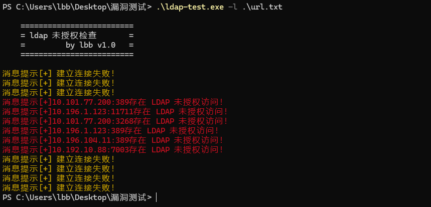

# LDAP TEST
> ldap test 是用于批量检查资产是否存在未授权访问的工具
### 工具特色
支持多线程批量检查

* 安装环境
```python
pip install click
pip install ldap3
```
* 命令主题
```shell
Usage: ldap-test.py [OPTIONS]

Options:
  -l, --lists TEXT   把资产文件放在和当前程序同级目录且文本格式为ip+端口号
  -t, --target TEXT  单个地址
  --help             Show this message and exit.

```
* 效果



